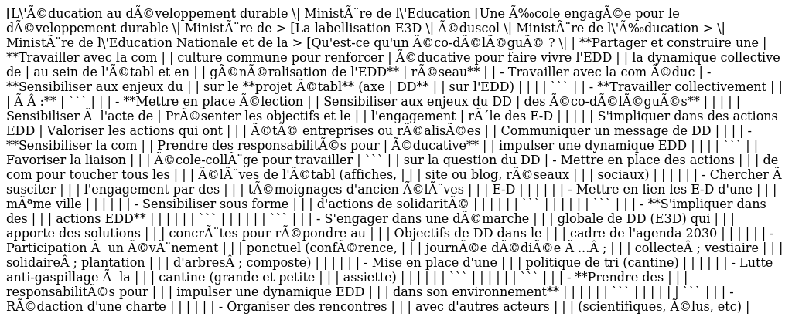

# Sommaire

- [Sommaire](#Sommaire)
- [1-LE-CLIMAT-SCOLAIRE](#1-LE-CLIMAT-SCOLAIRE)
- [2-LA-JUSTICE-SCOLAIRE](#2-LA-JUSTICE-SCOLAIRE)
- [3-VIOLENCE-ET-HARCELEMENT](#3-VIOLENCE-ET-HARCELEMENT)
- [4-SANTIONS-ET-PUNITIONS](#4-SANTIONS-ET-PUNITIONS)
- [5-LE-DECROCHAGE-SCOLAIRE-ABSENTEISME](#5-LE-DECROCHAGE-SCOLAIRE-ABSENTEISME)
- [6-EDUCATION-PRIORITAIRE](#6-EDUCATION-PRIORITAIRE)
- [7-MIXITE-SOCIALE-ET-INEGALITES](#7-MIXITE-SOCIALE-ET-INEGALITES)
- [8-PAUVRETE-A-LECOLE](#8-PAUVRETE-A-LECOLE)
- [9-EGALITE-FILLE-GARCON](#9-EGALITE-FILLE-GARCON)
- [10-ECOLE-INCLUSIVE](#10-ECOLE-INCLUSIVE)
- [11-ECOLE-FAMILLE](#11-ECOLE-FAMILLE)
- [12-EDUCATION-DEVELOPPEMENT-DURABLE](#12-EDUCATION-DEVELOPPEMENT-DURABLE)
- [13-EDUCATION-CITOYENNETE-VAL-REP](#13-EDUCATION-CITOYENNETE-VAL-REP)
- [14-LAICITE-A-LECOLE](#14-LAICITE-A-LECOLE)
- [15-NUMERIQUE](#15-NUMERIQUE)
- [16-ESPACE-SCOLAIRE](#16-ESPACE-SCOLAIRE)
- [17-LES-CONDUITES-ADDICTIVES](#17-LES-CONDUITES-ADDICTIVES)
- [18-RECAP-PARCOURS-EDUCATIFS](#18-RECAP-PARCOURS-EDUCATIFS)
- [Méthodo-oraux-concours](#Méthodo-oraux-concours)
# Sommaire
[Retour au sommaire](#sommaire)

# 1-LE-CLIMAT-SCOLAIRE
[Retour au sommaire](#sommaire)


# 2-LA-JUSTICE-SCOLAIRE
[Retour au sommaire](#sommaire)


# 3-VIOLENCE-ET-HARCELEMENT
[Retour au sommaire](#sommaire)


# 4-SANTIONS-ET-PUNITIONS
[Retour au sommaire](#sommaire)


# 5-LE-DECROCHAGE-SCOLAIRE-ABSENTEISME
[Retour au sommaire](#sommaire)


# 6-EDUCATION-PRIORITAIRE
[Retour au sommaire](#sommaire)


# 7-MIXITE-SOCIALE-ET-INEGALITES
[Retour au sommaire](#sommaire)


# 8-PAUVRETE-A-LECOLE
[Retour au sommaire](#sommaire)


# 9-EGALITE-FILLE-GARCON
[Retour au sommaire](#sommaire)


# 10-ECOLE-INCLUSIVE
[Retour au sommaire](#sommaire)


# 11-ECOLE-FAMILLE
[Retour au sommaire](#sommaire)


# 12-EDUCATION-DEVELOPPEMENT-DURABLE
[Retour au sommaire](#sommaire)




# 13-EDUCATION-CITOYENNETE-VAL-REP
[Retour au sommaire](#sommaire)


# 14-LAICITE-A-LECOLE
[Retour au sommaire](#sommaire)


# 15-NUMERIQUE
[Retour au sommaire](#sommaire)


# 16-ESPACE-SCOLAIRE
[Retour au sommaire](#sommaire)


# 17-LES-CONDUITES-ADDICTIVES
[Retour au sommaire](#sommaire)

Selon la DEPP, en 2021, 29,1% des élèves de 3e ont expérimenté la
cigarette. Ainsi, le tabagisme quotidien apparait surtout en classe de
troisième, se poursuit et progresse durant les années lycée, passant de
14 % de fumeurs en seconde à 21,5 % en terminale.

Pour limiter les conduites addictives, les boissons énergisantes sont
interdites depuis 2008 dans l'enceinte des établissements. Leurs
ingrédients peuvent entraîner une hyper excitation, une irritabilité,
une nervosité et une augmentation de l\'anxiété. Et ainsi, toutes
boissons alcoolisées et de consommation de substances illicites sont
également interdites.

L'addiction se caractérise par l'impossibilité répétée de contrôler un
comportement et la poursuite de ce comportement en dépit de la
connaissance de ses conséquences négatives. La notion de conduite
addictive comprend à la fois les addictions aux substances psychoactives
(alcool, tabac, drogues illicites) mais également les addictions
comportementales, sans substances psychoactives (jeu, par exemple).

La prévention des conduites addictives en milieu scolaire s'inscrit dans
une démarche globale de promotion de la santé et d'éducation à la
citoyenneté. Dans le second degré, les addictions et la lutte contre les
conduites addictives sont également abordées dans le cadre des
enseignements disciplinaires. Par exemple, dans les programmes de
sciences de la vie et de la Terre, de prévention santé environnement
**(PSE)** en enseignement professionnel qui comporte un volet relatif
aux conduites addictives et leurs conséquences, les mesures préventives
de la lutte contre les addictions, les mesures répressives associées.

L'éducation aux médias et à l'information (EMI) et l'enseignement moral
et civique (EMC) participent également à cette prévention.

**[ENJEUX]** :

-   Permettre à chaque jeune d'adopter des comportements responsables et
    faire des choix éclairés pour lui-même et pour les autres dans la
    perspective d'une citoyenneté active.

-   Elle vise à aider chaque jeune à s'approprier progressivement les
    moyens d'opérer des choix, d'adopter des comportements responsables,
    pour lui-même comme vis-à-vis d'autrui et de l'environnement. Elle
    permet de le préparer à exercer sa citoyenneté avec responsabilité
    et contribue à la construction individuelle et sociale des enfants
    et des adolescents. Elle constitue ainsi une composante de
    l'éducation du citoyen.

**[Cadre]**

-   **Parcours santé** crée en 2013 par la loi PEILLON avec pour
    objectif d'assurer l'éducation, la prévention et la protection de la
    santé des élèves

-   **Loi de 2019** = école de la confiance bien être des élèves

-   **BATTAGLIA**, *[Les conduites addictives]*, 2014

**[Diagnostic]** : élève fatigué en classe, chute des
résultats, retard, abs, de plus en plus d'élèves fumeurs devant
l'établissement

**[ACTIONS :]** Donner aux élèves les moyens de maîtriser
des connaissances et des compétences relatives à leur santé et à leur
bien-être notamment dans le domaine des addictions.

Établir un partenariat avec la **Consultation jeunes consommateurs**
(CJC) de proximité, crée en 2005

Dans le cadre du CESCE

Lien avec infirmière et Psy EN

**1^re^ séance :**

-   **Brainstorming** sur « les consommations addictives »

-   Regrouper par thématique : alcool, drogue, sexualité, jeux vidéo,
    outils numériques

-   Montrer des vidéos sur chaque thème

-   Sensibiliser les élèves sur le fait que la [substance
    consommée] peut être détectée dans notre corps après
    plusieurs heures et jours après consommation

-   Débat avec les élèves, leur ressenti, comment réduire, à qui en
    parler

-   Rappeler la loi, prison, amende, conséquence sur soi

**2^e^ séance :**

-   **Fiche info anonyme** as-tu déjà consommé, si oui = quel produit ;
    la fréquence ; pourquoi ; depuis combien de temps ; essaies-tu
    d'arrêter conduire les élèves à une prise de conscience

-   Ramassage des fiches, mélanger, redistribuer et chacun peut lire la
    fiche pour que l'ensemble se rendre compte

-   Travailler sur les compositions des produits, sur les effets
    néfastes, les conséquences de ces consommations addictives

**3^e^ séance :**

-   **Réalisation d'affiche** de prévention sur une conduite à risque,
    en groupe

**AUTRES ACTIONS :** Donner les moyens aux élèves d'être aptes à
demander de l'aide pour eux-mêmes et pour les autres.

**Depuis 2016, le ministère chargé de l\'éducation nationale soutient
l\'opération « Moi(s) Sans Tabac »**

17% des lycéens fument quotidiennement et les lycéens pro fument plus
que les lycéens généraux

**Avec les élèves du CVL, organiser la semaine sans tabac au sein du
lycée**

-   Créer une affiche sur l'évènement

-   Délégué de classe passe l'info en classe

-   Organisation d'un stand à l'effigie du mois sans tabac (stand jaune)
    où on expose les affiches des élèves sur la prévention des conduites
    addictives

-   Lycéens peuvent voter au stand pour la meilleure affiche

-   Sur le stand : CJC, flyer sur comment réduire sa conso, comment
    s'occuper l'esprit, etc

-   Les élèves peuvent discuter avec des professionnels

**Meilleures affiches** : afficher à l'infirmerie sur l'année, lien avec
la mairie pour afficher dans la ville, sur l'ENT

**EVALUER L'ACTION !!**

**Perspectives Organiser une conférence** dans l'établissement en fin de
journée avec les enseignants de PSE, des professionnels de santé
(psychiatre, psychologue), sur les conduites addictives et quelques
conseils, en invitant les parents pour faire de la prévention et
répondre à leurs questions et inquiétudes sur ces conduites

**[La place du CPE]**

Conseiller technique du CE conseiller sur mesures disciplinaires,
commission éducative, projet d'actions

Responsable de service AED référent de classe = rôle alerte sur les abs,
retard, comportement etc

Lien avec les familles, coéducation

Travail en étroite collaboration dans le cadre de l'action éducative
avec les personnels socio de santé et psy EN pour le bien être des
élèves, leur santé, leur sécurité = réussite


# 18-RECAP-PARCOURS-EDUCATIFS
[Retour au sommaire](#sommaire)

**[PARCOURS CITOYEN]**
==================================

Vivre-ensemble ; insertion sociale et professionnelle ; épanouissement
per = climat scolaire

**[Objectifs]** :

-   Expliquer les droits, devoirs et responsabilités

-   Développer l'esprit critique

-   Forger la culture de l'engagement

-   Transmettre les valeurs de la république

EMC + EMI + Réserve citoyenne + semaine de l'engagement et de la
démocratie scolaire

**Semaine de l'engagement** 3 semaines où les élèves sont sensibilisés à
l'engagement dans l'établissement

Au lycée par exemple, avec le référent vie lycéenne qui organise des
séances sur l'engagement, fait découvrir aux élèves leurs droits et
devoirs, découvrent le fonctionnement des instances,

**Semaine de la démocratie** les élections ont lieu après les 3 semaines
de l'engagement

Développe le sentiment d'appartenance

**[PARCOURS SANTE]**
================================

Bien-être, sécurité, citoyenneté, responsabilité

**Loi PEILLON -- 2013** *Les élèves bénéficient d'actions de prévention
et d'information, de visites médicales et de dépistages obligatoires qui
constituent leur parcours de santé*

**L'éducation** développement de compétences, connaissances

**Prévention** informer et limiter les conduites à risques

**Protection** créer un environnement favorable au bien être et à la
santé

**[PARCOURS AVENIR]** 
=================================

Insertion sociale et professionnelle ; développement personnel ;
réussite scolaire

**Loi PEILLON -- 2013** : création du parcours avenir = parcours
individuel d'information et de découverte du monde économique et
professionnel (institué en 2015)

-   Découverte du monde économique et professionnel

-   Développer le sens de l'initiative et de l'engagement

-   Elaborer un projet d'orientation scolaire et professionnel

**[PARCOURS ART ET CULTURE]** 
=========================================

Favoriser un égal accès à l'art et à la culture à tous les élèves, peu
importe leur milieu

**Objectif** Mettre en cohérence enseignements et actions éducatives,
les relier aux expériences personnelles, les enrichir et les diversifier


# Méthodo-oraux-concours
[Retour au sommaire](#sommaire)

**A court, moyen et long terme !**

**Ou selon des échelles (au niveau de l'élève, de la classe, de
l'établissement)**

-   S'approprier les **valeurs de la république **:

    -   Liberté

    -   L'égalité

    -   Respect

    -   Fraternité

    -   Indivisibilité (ce qui nous rapproche, faire société ensemble
        par les mêmes droits et mêmes devoirs = vivre-ensemble)

    -   Laïcité, démocratie

    -   Justice sociale

    -   Respect de toutes les croyances

    -   Inclusion

-   **Les exigences du services publics** : la nécessité de faire
    acquérir à tous les élèves le respect de l'égale dignité, des êtres
    humains, de la liberté de conscience et de la laïcité et de
    favoriser la coopération entre les élèves

[**Droits et obligations du fonctionnaire** :]

-   **[Obligation]** :

    -   Neutralité

    -   Obligation de sécurité

    -   Obligation d\'obéissance hiérarchique

    -   Obligation d\'effectuer les tâches confiées

    -   Secret pro

    -   Obligation d\'information au public

    -   Obligation de discrétion professionnelle

-   [**Droit **:]

```

```
-   Droit de grève,

-   Droit syndical,

-   Droit à la formation professionnelle tout au long de la vie,

-   Droit de participation,

-   Droit à rémunération après service fait,

-   Droit au congé,

-   Droit à la protection fonctionnelle,

-   Droit à la protection des auteurs de signalements.

-   Liberté d\'opinion politique, syndicale, philosophique ou
    religieuse,

-   Liberté d'expression

EPREUVE DE DOSSIER

-   Lire les textes du dossier

-   Le tire aiguille sur la thématique et la problématique

-   Mettre les textes en relation

-   Rechercher sur internet

-   (Possibilité d'utiliser un diapo)

-   Faire des propositions d'actions en lien avec la démarche de projet

**[INTRODUCTION]**

-   Possibilité de la rédiger au brouillon mais sans la lire

-   Définir les termes du sujet

-   Mettre le sujet en perspective / enjeux du sujet pour
    l'établissement mais aussi pour la société

-   Annonce problématique

-   Présenter doc (regrouper si possible)

-   Annonce plan

**[Plan]**

En 3 parties

Dire « JE » ou « Nous »

**[1ere partie]** : Poser le cadre, contexte, les enjeux,
aspect théorique, lois, auteurs (2 à 3)

**[2^e^ partie]** : démarche de projet (dans la partie
évaluation donner les limites, les freins

Donner des actions en lien avec les **[compétences]** que
les élèves doivent acquérir (pédagogique)

Faire référence aux docs

**Dernière partie** = place du CPE, son action,

**[Conclusion]**

-   Peut être aussi rédiger pour éviter le stress

-   Doit reprendre les principaux éléments de notre développement

-   Doit répondre à la problématique

-   Parler des limites de notre projet

Eviter un catalogue d'actions

Savoir faire des choix (dans le publics notamment) et les justifier

Pour le budget dire qu'on se rapproche auprès du gestionnaire, après
validation du chef d'établissement sur le projet, on fait une appel à
projet pour le financement

Etre claire et explicite, propos structuré


